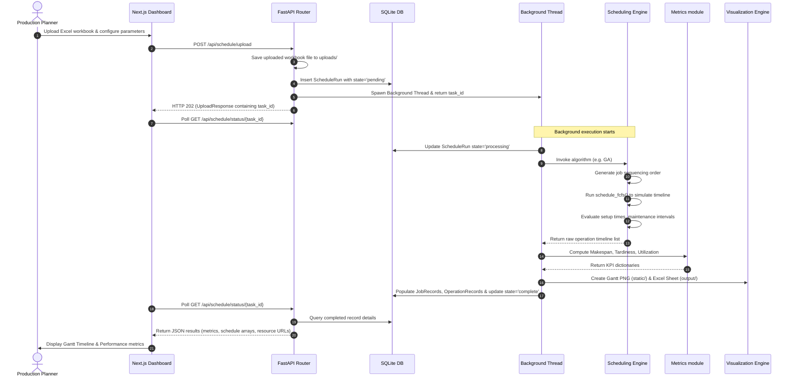

# ShopFloorScheduler Brain : Repository Knowledge Base

This document serves as the permanent knowledge base and single source of truth for the **ShopFloorScheduler** repository. It contains comprehensive documentation of the project's architecture, data models, APIs, core logic, known technical debt, and implementation instructions for AI coding agents.

---

# Project Overview

*   **Project Name:** ShopFloorScheduler (also referred to as PyShop Scheduler)
*   **Purpose:** An AI-powered production scheduling and optimization system designed to solve complex Job Shop Scheduling problems. It automatically generates near-optimal schedules that minimize makespan (total completion time) and job tardiness while honoring real-world constraints such as machine unavailability/maintenance windows and setup times.
*   **Current Development Stage:** Phase 1 complete. A Next.js (TypeScript) dashboard frontend and a FastAPI backend with SQLAlchemy/SQLite database integration have been built.
    *   **High-Level Architecture:**
    *   **Frontend:** React/Next.js dashboard app.
    *   **Backend:** FastAPI web server implementing RESTful APIs.
    *   **Database:** SQLite database (`shopfloor.db`) managed via SQLAlchemy ORM. All task state is persisted here — no in-memory caching.
    *   **Background Tasks:** In-process background threading (`threading.Thread`) serves as the async worker engine. Task state is written directly to SQLite so it survives server restarts. (Note: Celery is configured via Redis, but currently bypassed in the FastAPI endpoints).
    *   **Optimization Layer:** Pure Python implementation of heuristics and a Multi-Objective Genetic Algorithm.
*   **Main Technologies:**
    *   Python 3.10+, FastAPI, Pydantic v2, SQLAlchemy 2.x, Loguru, Matplotlib, Pandas, openpyxl.
    *   TypeScript, React, Next.js 15 (App Router), Tailwind CSS.
    *   Celery & Redis (configured infrastructure, currently unused).
*   **Overall Workflow:**
    1.  The user uploads an Excel workbook containing `Jobs` and `Machines` sheets.
    2.  The API saves the dataset, updates database state to `pending`, and kicks off a background thread.
    3.  The background thread parses the Excel data, runs the chosen algorithm (Genetic Algorithm, FCFS, SPT, EDD, or WSPT), computes scheduling metrics, renders a Gantt chart, and writes a detailed Excel report.
    4.  SQLite tables are populated with results, and task status is set to `complete`.
    5.  The Next.js frontend polls for task completion, displaying KPI metrics, a horizontal Gantt timeline, and providing download links.

---

# Current Features

*   **Heuristic Scheduling Algorithms:**
    *   **FCFS (First-Come, First-Served):** Runs jobs in the order they are defined. Acts as the base constraint validator.
    *   **SPT (Shortest Processing Time):** Sorts jobs by total processing time in ascending order.
    *   **EDD (Earliest Due Date):** Sorts jobs by due date in ascending order to minimize tardiness.
    *   **WSPT (Weighted Shortest Processing Time):** Sorts jobs by total processing time divided by priority.
*   **Genetic Algorithm (GA):**
    *   A custom metaheuristic engine that evolves job sequence permutations.
    *   **Multi-Objective Fitness:** Minimizes a weighted sum of makespan and tardiness: `fitness = (makespan * w_makespan) + (total_tardiness * w_tardiness)`.
    *   Supports tournament selection, ordered crossover (OX1), swap mutation, and elitism.
*   **Gantt Visualization:** Renders machine-wise schedule timelines using `matplotlib` (saved as PNG files).
*   **CSV/Excel/JSON Data Loader:** Flexible loading modules parsing machine unavailability ranges and multi-operation job paths.
*   **Excel Report Generation:** Generates multi-sheet spreadsheets displaying detailed schedule timelines and summary metrics.
*   **Next.js Dashboard UI:** Modern, responsive interface with configuration forms, KPI cards, real-time polling tracking, history tables, and interactive schedules.

---

# Current Folder Structure

```
ShopFloorScheduler/
├── api/                         # FastAPI Application Layer
│   ├── routers/                 # API Routes
│   │   ├── health.py            # System health checks
│   │   ├── history.py           # Paginated database query history (TASK-15)
│   │   └── schedule.py          # Upload, status, download, and execution endpoints (TASK-13/14)
│   ├── __init__.py
│   ├── main.py                  # API entry point & DB initialization
│   └── schemas.py               # Pydantic v2 validation contracts
├── core/                        # Core Utilities
│   ├── database.py              # SQLAlchemy engine, session helper, and table creation
│   ├── logger.py                # Centralized Loguru logger (stdout + logs/ file)
│   └── models_db.py             # SQLAlchemy ORM schemas
├── scheduler/                   # Core Scheduling Logic
│   ├── engine.py                # Scheduling algorithms (FCFS, SPT, EDD, WSPT)
│   ├── metrics.py               # Pure functions computing makespan, tardiness, utilization
│   └── tasks.py                 # Asynchronous Celery task wrappers (unused by active endpoints)
├── docs/                        # Project Requirements and Design Specs
│   ├── DESIGN.md                # UI/UX guidelines and SaaS design tokens
│   └── PRD.md                   # Product specs and phase roadmaps
├── frontend/                    # Next.js Frontend Application
│   ├── src/                     # React source files
│   │   ├── app/                 # App Router (layouts and pages)
│   │   │   ├── (dashboard)/     # Main dashboard workspace layout
│   │   │   └── globals.css      # Core styles
│   │   ├── components/          # Reusable UI widgets (Gantt, forms, status bars)
│   │   └── lib/                 # Typed fetch client helpers (api.ts)
│   ├── package.json             # NPM dependencies
│   └── tsconfig.json            # TypeScript settings
├── logs/                        # Execution log files
├── output/                      # Generated Excel reports (schedule_*.xlsx)
├── static/                      # Generated Gantt chart images (gantt_*.png)
├── uploads/                     # Uploaded raw Excel files (uuid.xlsx)
├── tests/                       # Pytest Test Suite
│   ├── conftest.py              # Shared fixtures (sample data, test DB, TestClient)
│   ├── test_api.py              # FastAPI endpoint integration tests
│   ├── test_data_loader.py      # Data parsing and loading tests
│   ├── test_engine.py           # Scheduling algorithm tests (FCFS, SPT, EDD, WSPT)
│   ├── test_genetic_algorithm.py # GA component and end-to-end tests
│   └── test_metrics.py          # KPI metric calculation tests
├── celery_app.py                # Celery instance configuration
├── config.ini                   # CLI settings & hyperparameter configurations
├── data_loader.py               # Raw excel, json, and gspread data loading functions
├── exporter.py                  # Excel multi-sheet reporting logic
├── genetic_algorithm.py         # Genetic algorithm logic
├── main.py                      # CLI runner script
├── models.py                    # Domain model classes (Job, Operation, Machine)
├── requirements.txt             # Python dependency list (includes pytest, httpx)
├── shopfloor.db                 # SQLite database file
├── tempCodeRunnerFile.py        # Temporary script execution cache
└── visualization.py             # Matplotlib rendering wrapper
```

---

# Core Modules

| Module Name | File Path | Primary Responsibility | Key Inputs | Key Outputs | Dependencies |
| :--- | :--- | :--- | :--- | :--- | :--- |
| **Main CLI** | [main.py](file:///c:/ShopFloorScheduler/main.py) | Executes local command-line runs and outputs simple heuristic comparison tables. | `config.ini`, `data.xlsx` | Output Excel schedules and Matplotlib charts. | `data_loader`, `visualization`, `exporter`, `genetic_algorithm`, `scheduler/engine`, `scheduler/metrics` |
| **Legacy Web Server** | [app.py](file:///c:/ShopFloorScheduler/app.py) | Traditional Flask server offering manual scheduling and chart rendering. | Uploaded workbook | HTML templates, excel reports. | `data_loader`, `genetic_algorithm`, `visualization`, `exporter` |
| **API Entrypoint** | [api/main.py](file:///c:/ShopFloorScheduler/api/main.py) | Instantiates FastAPI, registers CORS, mounts static paths, and triggers database init on startup. | Environment configurations | Swagger JSON / Docs page. | `core/database`, `api/routers/*` |
| **Scheduling Router** | [api/routers/schedule.py](file:///c:/ShopFloorScheduler/api/routers/schedule.py) | Coordinates file uploading, triggers background worker threads, monitors execution states, and handles spreadsheet downloads. | File multipart payloads, scheduling settings | Task IDs, download binary wrappers. | `data_loader`, `scheduler/engine`, `scheduler/metrics`, `visualization`, `exporter`, `genetic_algorithm`, `core/database` |
| **Data Loader** | [data_loader.py](file:///c:/ShopFloorScheduler/data_loader.py) | Parses Excel/JSON datasets and generates object maps. Contains parsing subroutines. | File paths, workbook streams | `list[Machine]`, `list[Job]` | `models`, `pandas`, `openpyxl`, `gspread` |
| **Scheduling Algorithms** | [scheduler/engine.py](file:///c:/ShopFloorScheduler/scheduler/engine.py) | Implements FCFS, SPT, EDD, and WSPT. FCFS functions as the core routing algorithm executing constraints. | `list[Job]`, `list[Machine]`, `setup_time` | `list[tuples]` (job_id, op_index, machine_id, start, end) | `models` |
| **Genetic Algorithm** | [genetic_algorithm.py](file:///c:/ShopFloorScheduler/genetic_algorithm.py) | Runs evolutionary scheduling search. | Jobs, machines, parameters | Optimized `list[tuples]` | `scheduler/engine` |
| **Metrics Collector** | [scheduler/metrics.py](file:///c:/ShopFloorScheduler/scheduler/metrics.py) | Computes makespan, tardiness, average flow time, and machine utilization details. | Schedule list, machine details, job parameters | Performance metric dictionaries | `models` |
| **Report Exporter** | [exporter.py](file:///c:/ShopFloorScheduler/exporter.py) | Creates multi-sheet Excel workbooks with schedule rows, job timelines, and metrics. | Raw schedule list, job list, filepath | Save Excel spreadsheet on disk. | `pandas`, `openpyxl` |
| **Gantt Visualizer** | [visualization.py](file:///c:/ShopFloorScheduler/visualization.py) | Renders timeline Gantt charts using a non-interactive matplotlib backend. | Schedule list, save path, title | Save PNG image on disk. | `matplotlib` |
| **Database Engine** | [core/database.py](file:///c:/ShopFloorScheduler/core/database.py) | Setup engine configurations, creates database context sessions, and establishes baseline declarative ORM. | Connection URI string | Database session contexts | `sqlalchemy` |
| **Database Models** | [core/models_db.py](file:///c:/ShopFloorScheduler/core/models_db.py) | Represents SQLAlchemy tables (`schedule_runs`, `job_records`, `operation_records`). | - | SQL schemas | `core/database` |

---

# Execution Flow

The Mermaid diagram below displays the step-by-step process of schedule generation, starting with user input and ending with data persistence and frontend visualization.



---

# Data Flow

Data flows through the system through specific serialization and parsing boundaries:

1.  **Ingestion:** The user's spreadsheet contains operations formatted as semicolon-delimited lists like `1(15); 2(20)`. The `data_loader.py` module regex-parses this into a list of [Operation](file:///c:/ShopFloorScheduler/models.py#L3) structures assigned to a [Job](file:///c:/ShopFloorScheduler/models.py#L13). Machine unavailability values like `10-20; 50-60` are translated into lists of tuples.
2.  **In-Memory Scheduling State:** The schedulers instantiate [Machine](file:///c:/ShopFloorScheduler/models.py#L25) states tracking `available_at` and `last_job_id`. For each job sequence permutation:
    *   Machines check their last job ID. If it is different, `setup_time` is added.
    *   Start times are aligned against operations' relative dependencies (jobs must run operations sequentially).
    *   Conflicts with unavailable windows are resolved: if a machine is offline, the operation start time is pushed forward to the end of the unavailability interval.
3.  **Result Pipeline:** The completed schedule is a raw list of tuples: `(job_id, operation_index, machine_id, start_time, end_time)`.
    *   The raw lists are evaluated by `scheduler/metrics.py` to yield execution stats.
    *   The lists are passed to `exporter.py` for conversion into Pandas DataFrames and Excel writing.
    *   The lists are mapped to `OperationRecord` models and persisted in SQLite.
4.  **Client Payload:** Pydantic schemas serialize the database models and file paths into JSON objects containing relative chart/excel endpoints like `/static/gantt_*.png` and `/api/schedule/download/*.xlsx`.

---

# Existing APIs

FastAPI routes are grouped under their specific domains:

### 1. Scheduling Endpoints

*   **Route:** `/api/schedule/upload`
    *   **Method:** `POST`
    *   **Request Format:** `multipart/form-data`
        *   `file`: Excel spreadsheet (.xlsx, .xls)
        *   `setup_time` (int, default=2)
        *   `algorithm` (string, default="GA")
        *   `pop_size` (int, default=30)
        *   `generations` (int, default=50)
        *   `mutation_rate` (float, default=0.1)
        *   `tournament_size` (int, default=3)
        *   `w_makespan` (float, default=0.6)
        *   `w_tardiness` (float, default=0.4)
    *   **Response (`UploadResponse`):**
        ```json
        {
          "task_id": "a9a3b0fa-d2df-423c-a931-df13b28b6d34",
          "message": "GA optimization started.",
          "status_url": "/api/schedule/status/a9a3b0fa-d2df-423c-a931-df13b28b6d34"
        }
        ```
    *   **Purpose:** Accepts scheduling data, starts background scheduling thread, and returns a unique tracker token.

*   **Route:** `/api/schedule/status/{task_id}`
    *   **Method:** `GET`
    *   **Response (`ScheduleStatusResponse`):** Returns task state (`pending`, `processing`, `complete`, `error`), optional message, and `result` payload (if complete).
    *   **Purpose:** Polling target for monitoring background scheduling progress.

*   **Route:** `/api/schedule/results/{task_id}`
    *   **Method:** `GET`
    *   **Response (`ScheduleStatusResponse`):** Same schema as status, returns 404 if state is not complete.
    *   **Purpose:** Explicit results retrieval endpoint.

*   **Route:** `/api/schedule/download/{filename}`
    *   **Method:** `GET`
    *   **Response:** File download stream (`application/vnd.openxmlformats-officedocument.spreadsheetml.sheet`).
    *   **Purpose:** Downloads generated multi-sheet Excel reports.

### 2. History Endpoints

*   **Route:** `/api/history`
    *   **Method:** `GET`
    *   **Query Parameters:**
        *   `page`: (int, default=1)
        *   `page_size`: (int, default=10)
        *   `algorithm`: filter string
        *   `status`: filter string
    *   **Response (`HistoryResponse`):**
        ```json
        {
          "items": [
            {
              "task_id": "uuid",
              "created_at": "ISO-8601",
              "status": "complete",
              "algorithm": "GA",
              "file_name": "data.xlsx",
              "makespan": 450.0,
              "total_tardiness": 20.0,
              "avg_flow_time": 120.0,
              "on_time_percent": 80.0
            }
          ],
          "total": 125,
          "page": 1,
          "page_size": 10,
          "pages": 13
        }
        ```
    *   **Purpose:** Provides a paginated history list of all historical scheduling runs.

### 3. Health check

*   **Route:** `/health`
    *   **Method:** `GET`
    *   **Response (`HealthResponse`):** `{"status": "ok", "version": "1.0.0"}`
    *   **Purpose:** Health check target.

---

# Data Models

### 1. Domain Object Models (`models.py`)

*   **`Operation`**
    *   `machine_id` (int): Target machine.
    *   `processing_time` (int): Duration of the operation.
*   **`Job`**
    *   `job_id` (int): Unique identifier.
    *   `operations` (list[Operation]): Ordered sequence of operations.
    *   `due_date` (int): Completion deadline.
    *   `priority` (int): Relative weight (priority) of the job.
*   **`Machine`**
    *   `machine_id` (int): Unique identifier.
    *   `unavailable_periods` (list[tuple[int, int]]): Down time windows.
    *   `available_at` (int): Tracks the earliest time units the machine becomes idle (used during scheduling simulation).
    *   `last_job_id` (int): ID of the last processed job (used for setup time evaluation).

### 2. SQL Database Models (`core/models_db.py`)

*   **`ScheduleRun`** (Table: `schedule_runs`)
    *   `id` (int, PK): Auto-increment identifier.
    *   `task_id` (str, Unique Index): Execution run UUID.
    *   `created_at` (datetime): Timestamp.
    *   `status` (str): Status (`pending`, `processing`, `complete`, `error`).
    *   `algorithm` (str): Chosen method (e.g. FCFS, GA).
    *   `file_name` (str): Name of the uploaded file.
    *   `makespan` (float): Optimized makespan metrics.
    *   `total_tardiness` (float): Total tardiness metrics.
    *   `avg_flow_time` (float): Average flow time metrics.
    *   `on_time_percent` (float): On-time completion percentage.
    *   `error_message` (str): Error message (if run failed).
    *   `chart_url` (str): URL to the generated Gantt chart PNG.
    *   `excel_url` (str): URL to download the generated Excel report.
    *   `result_json` (str/Text): Full serialized JSON result payload (schedule, utilization, URLs). Used for fast status/results endpoint responses without JOINs.
*   **`JobRecord`** (Table: `job_records`)
    *   `id` (int, PK): Auto-increment identifier.
    *   `run_id` (int, FK): Associated `ScheduleRun.id`.
    *   `job_id` (str): Job ID.
    *   `due_date` (float): Deadline.
    *   `completion_time` (float): Final completion time units.
    *   `tardiness` (float): Job tardiness units.
*   **`OperationRecord`** (Table: `operation_records`)
    *   `id` (int, PK): Auto-increment identifier.
    *   `run_id` (int, FK): Associated `ScheduleRun.id`.
    *   `job_id` (str): Job ID.
    *   `op_index` (int): Operation index within the job.
    *   `machine_id` (str): Target machine.
    *   `start_time` (float): Start time.
    *   `end_time` (float): Completion time.

---

# Scheduling Engine

### 1. Execution Flow & Logic
The base logic resides inside `schedule_fcfs` (defined in [engine.py](file:///c:/ShopFloorScheduler/scheduler/engine.py#L19)). Jobs are scheduled step-by-step in the sequence they are ordered. The heuristic models (SPT, EDD, WSPT) sort jobs first, then run FCFS.

*   **Constraint Resolution:**
    *   **Precedence:** An operation can only start after the previous operation in the same job completes (`earliest_start = max(machine.available_at + setup, current_job_end_time)`).
    *   **Machine Setup:** If `machine.last_job_id` is not None and doesn't match the current job's ID, a setup penalty (`setup_time`) is added to the start time.
    *   **Unavailability (Maintenance):** If the planned operation interval overlaps with any maintenance window `(down_start, down_end)`, the start time is pushed forward to the end of the window: `start_time = down_end`. This check loops until a conflict-free window is found.

### 2. Multi-Objective Genetic Algorithm (GA)
The GA is defined in [genetic_algorithm.py](file:///c:/ShopFloorScheduler/genetic_algorithm.py#L16).
*   **Chromosome Structure:** An ordered permutation list of `Job` objects representing the scheduling priority.
*   **Initial Population:** Permutations generated via random samples (`random.sample`).
*   **Fitness Evaluation:**
    *   For each chromosome, we simulate scheduling using FCFS and calculate performance metrics:
        *   `makespan` (completion time of the last operation).
        *   `total_tardiness` (sum of delays beyond deadlines).
    *   `fitness = (makespan * w_makespan) + (total_tardiness * w_tardiness)`.
    *   Lower score = higher fitness (minimization target).
*   **Selection:** Tournament Selection. `tourn_size` chromosomes are selected at random, and the best-performing one is chosen.
*   **Crossover:** Ordered Crossover (OX1). Prevents duplicates by extracting a slice from parent 1, and filling the rest with parent 2's jobs in order.
*   **Mutation:** Swap Mutation. Two random index jobs are swapped inside the chromosome order based on `mutation_rate`.
*   **Elitism:** The best chromosome from each generation is carried over directly to the next generation.

---

# Visualization System

*   **Technology:** Non-interactive Matplotlib library using the `Agg` backend (`matplotlib.use('Agg')`).
*   **Chart Format:** Gantt Chart PNG images saved to `static/gantt_{task_id}.png`.
*   **Details:**
    *   Y-axis represents machines.
    *   X-axis represents time units.
    *   Jobs are represented by colored horizontal bars. A color map dynamically maps colors to unique job IDs.
    *   Text overlays label operations (e.g., `J1` represents Job 1).
    *   Gridlines display major (5-unit) and minor (1-unit) intervals.
    *   Legends identify colors for each job.

---

# Known Technical Debt

### 1. ~~Signature Mismatch Bugs in FastAPI Endpoint~~ (RESOLVED)
The original bugs documented here (GA unpacking error and Excel exporter parameter mismatch) were fixed in a prior refactor. However, a new critical bug — **swapped return value unpacking** — was introduced during the refactor and has now been resolved:
*   **Swapped Tuple Unpacking (FIXED):**
    *   *Code:* `jobs, machines = load_data_from_excel(filepath)` (Line 87)
    *   *Defect:* `load_data_from_excel()` returns `(machines, jobs)` but the schedule router unpacked them in reverse order, causing all scheduling algorithms to crash with `AttributeError`.
    *   *Fix:* Corrected to `machines, jobs = load_data_from_excel(filepath)`.


### 2. Bypassed Task Queue Infrastructure
*   Although `celery_app.py` and `scheduler/tasks.py` are configured for Redis, the endpoints in `api/routers/schedule.py` bypass Celery. Instead, they spawn in-process background threads (`threading.Thread`).
*   Tasks now persist state directly to SQLite, so in-progress tasks survive server restarts (state is recoverable). However, horizontal scaling still requires Celery.

### ~~3. In-Memory State Cache~~ (RESOLVED)
*   The `_JOBS` dictionary has been **removed** from `api/routers/schedule.py`. All task state (pending → processing → complete/error) is now read from and written to SQLite exclusively. The `result_json` column stores the full serialized result payload. Status and results endpoints query the database directly.

### 4. Code Duplication
*   `app.py` (legacy Flask app) and `api/routers/schedule.py` duplicate dataset parsing, scheduling calls, metrics generation, and file exporting.
*   The fitness logic in `genetic_algorithm.py` (`calculate_tardiness`) duplicates logic in `scheduler/metrics.py`.

### ~~5. Missing Test Coverage~~ (RESOLVED)
*   A comprehensive Pytest test suite has been added in `tests/` with 59 tests covering:
    *   Scheduling algorithms (FCFS, SPT, EDD, WSPT) — setup time, unavailability, precedence, no-overlap constraints.
    *   Metric calculations (makespan, tardiness, utilization, flow time, on-time %).
    *   Genetic algorithm components (population, crossover, mutation, selection) and end-to-end runs.
    *   Data loader parsing (operations, unavailability periods, Excel, JSON).
    *   API endpoints (health, upload validation, status, results, history pagination).
*   Run with: `python -m pytest tests/ -v`

---

# Coding Standards

*   **Naming Conventions:**
    *   Python variables and functions: `snake_case`.
    *   Classes: `PascalCase`.
    *   SQL tables: plural `snake_case` (e.g. `schedule_runs`).
*   **Imports:** Clean, sorted, explicit module imports. Avoid circular imports (e.g. resolve scheduling/GA interactions carefully).
*   **Error Handling:**
    *   Do not call `sys.exit()` in utility scripts.
    *   Raise `ValueError` or `RuntimeError` for corrupt data formats, and catch them at the API layer to return helpful error responses.
*   **Logging:** Use `loguru` and import `logger` from `core.logger`. Do not print to stdout with `print()`. Logs write to both stdout and rotating daily files in `logs/shopfloor_*.log`.
*   **Formatting:** Clean code formatted with `black` conventions. Keep lines under 120 characters where possible.

---

# Development Roadmap

The roadmap has been planned in distinct implementation phases:

### Phase 1: Core Infrastructure (Complete / In-Progress Tasks)
*   [x] **TASK-01:** FastAPI migration replacing legacy Flask layers.
*   [x] **TASK-03:** Celery / Redis task queue configuration.
*   [x] **TASK-04:** Pydantic validation schema definitions.
*   [x] **TASK-05:** Centralized structured logging setup.
*   [x] **TASK-13:** SQLite database integration with SQLAlchemy.
*   [x] **TASK-14:** Scheduling run persistence logic.
*   [x] **TASK-15:** Paginated run history endpoint.

### Phase 2: Production Readiness (Complete / In-Progress)
*   [x] **Fix critical API bugs:** Resolved swapped return-value unpacking in `api/routers/schedule.py` (was `jobs, machines = ...`, corrected to `machines, jobs = ...`).
*   [ ] **Celery Integration:** Route tasks through the Celery worker queue instead of in-process threads. (Deferred — requires Redis on the host).
*   [x] **Database Polling:** Removed the `_JOBS` in-memory dictionary. All status polling now queries SQLite directly. Added `result_json`, `chart_url`, `excel_url` columns to `ScheduleRun`.
*   [x] **Testing Suite:** Added 59 Pytest tests across 5 modules covering engine, metrics, GA, data loader, and API endpoints.

### Phase 3: Enterprise Features (Complete)
*   [x] **Authentication:** JWT-based user authentication.
*   [x] **PostgreSQL Migration:** Transition database backend to PostgreSQL (fully supported via DATABASE_URL and psycopg2-binary driver).
*   [x] **Dynamic Rescheduling:** Support real-time updates for machine downtime and rush orders.
*   [x] **Analytics Dashboard:** Build interactive utilization heatmaps and tardiness charts.
*   [x] **WebSockets:** Implement real-time task progress tracking.
*   [x] **Dockerization:** Containerize backend, workers, and Next.js frontend.
*   [x] **ERP Integration:** Integrate standard ERP inputs and outputs (generic JSON/Excel/CSV import adapter layers).

---

# AI Agent Instructions

Future AI agents working on this project must follow these rules:

1.  **Read `BRAIN.md` First:** Always read this document before making code modifications.
2.  **Avoid Redundant Scanning:** Do not rescan the entire repository unless `BRAIN.md` is outdated or you are explicitly requested to.
3.  **Preserve Functionality:** Refactor code rather than rewriting it. Keep modules loosely coupled.
4.  **No Duplicate Logic:** Avoid duplicating business logic. Reuse functions in `scheduler/metrics.py` and `scheduler/engine.py`.
5.  **Maintain `BRAIN.md`:** Update this document after completing any task that:
    *   Modifies project architecture.
    *   Adds, moves, or removes files and dependencies.
    *   Updates or introduces new API routes.
    *   Implements roadmap items.
6.  **Single Source of Truth:** Treat `BRAIN.md` as the definitive guide for project context.
